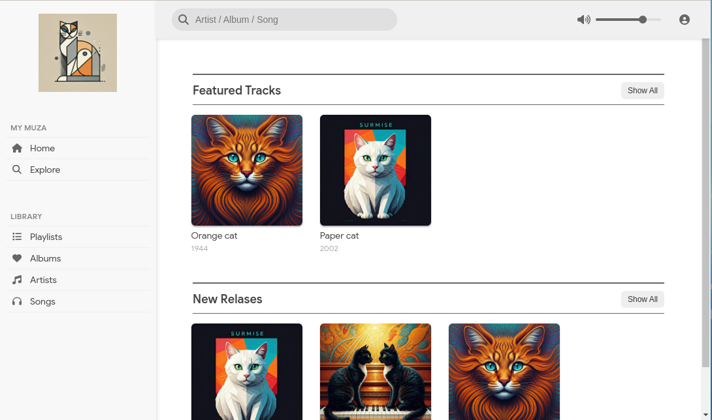

# Muza Lit Library

A lightweight web components library for displaying music tracks and sections using Lit.



## Features

- `<music-track>` - Display individual music tracks with artwork
- `<music-section>` - Create sections of multiple music tracks
- `<music-sidebar>` - Navigation sidebar with customizable sections and menu items
- `<music-topbar>` - Top navigation bar with search and volume controls

## Installation

```bash
npm install muza-lit-library
```

## Usage

Import and use the components in your HTML:

```html
<!-- Top Navigation Bar -->
<music-topbar></music-topbar>

<!-- Single Track -->
<music-track 
  image-src="art/track.jpg" 
  title="Track Title" 
  sub-title="2023"
></music-track>

<!-- Track Section -->
<music-section 
  title="Featured Tracks" 
  tracks='[
    {"imageSrc": "art/track1.jpg", "title": "Track 1", "subTitle": "2023"},
    {"imageSrc": "art/track2.jpg", "title": "Track 2", "subTitle": "2023"}
  ]'
></music-section>

<!-- Sidebar Navigation -->
<music-sidebar
  logo-src="art/logo.jpg"
  logo-alt="Music Library">
</music-sidebar>

<script>
  // Configure sidebar sections and items
  const sidebar = document.querySelector('music-sidebar');
  sidebar.sections = [
    {
      title: 'My Muza',
      items: [
        { icon: 'house', text: 'Home' },
        { icon: 'search', text: 'Explore' }
      ]
    },
    {
      title: 'Library',
      items: [
        { icon: 'square-plus', text: 'Playlists' },
        { icon: 'heart', text: 'Albums' }
      ]
    }
  ];
</script>
```

### Topbar Features

The `<music-topbar>` component provides:
- Search functionality with real-time updates
- Volume control with slider
- User menu icon
- Emits events:
  - `search-change`: When search input changes
  - `volume-change`: When volume is adjusted
  - `user-icon-click`: When user icon is clicked

### Sidebar Properties

- `logo-src`: URL of the logo image
- `logo-alt`: Alt text for the logo image
- `sections`: Array of section objects containing:
  - `title`: Section header text
  - `items`: Array of menu items with:
    - `icon`: Font Awesome icon name
    - `text`: Menu item text
    - `action`: Optional click handler function

## Development

1. Clone the repository
2. Install dependencies: `npm install`
3. Start development server: `npm run dev`

## License

MIT License - See LICENSE file for details
